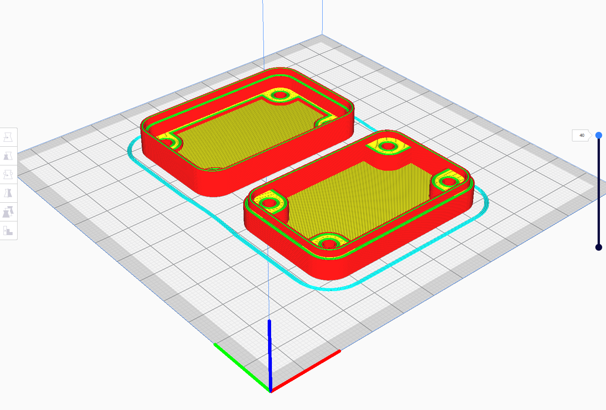
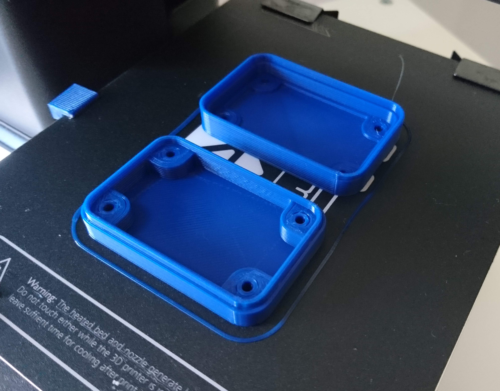
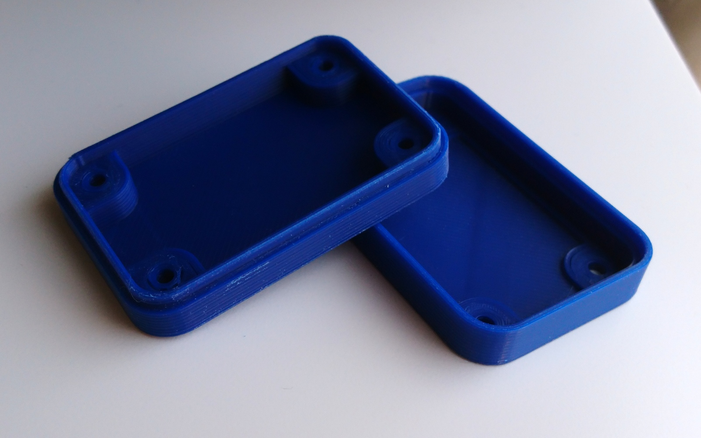
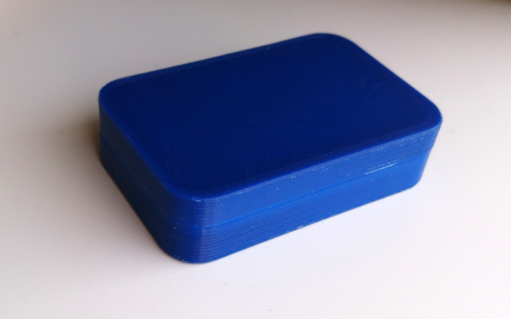

# OpenSCAD simple 3d printable project boxes

This is an OpenSCAD library for the creation of simple multipart project cases that can be 3d printed.  

>This image shows the case variants and is created from /tests/sob_tests.scad

The library is created in [OpenSCAD](http://www.openscad.org/) and is intended for 3d printing using a nothing-special FDM printer with a 0.4mm nozzle.

The box is split into three stacking parts, the top, middle and bottom (Not yet complete) and is designed to house electronics projects that use the Dangerous Prototypes [Sick Of Beige PCB standard](http://dangerousprototypes.com/docs/Sick_of_Beige_standard_PCB_sizes_v1.0).

The height, width and depth of the case are configurable to any dimensions (not just SOB standards) using "global" variables that you can override.  However the rounded corners and mounting hole locations and diameters are fixed based on the SOB standard.

The top and middle parts of the case interlock using an overlapping lip. The middle part of the case can have an open bottom, a single crosmember or be completely solid.  The entire case is held together by screws from underneath that screw into pads in the top.

### Example of DP5031 case

[DP5031 sample SCAD file](tests/DP5031.scad)

>CURA preview

>Printed in draft 0.4mm nozzle, 0.2mm layers

>After a bit of tidying up with a file and cutter to remove the first layer "splodge"

>Completed case closed.  A small case like this one locks together very tighly.

Copyright (C) 2019 Matt Casey : catmacey.com
This program is free software: you can redistribute it and/or modify it under the terms of the GNU General Public License as published by the Free Software Foundation, either version 3 of the License, or (at your option) any later version.
	
This program is distributed in the hope that it will be useful, but WITHOUT ANY WARRANTY; without even the implied warranty of MERCHANTABILITY or FITNESS FOR A PARTICULAR PURPOSE.  See the GNU General Public License for more details.
